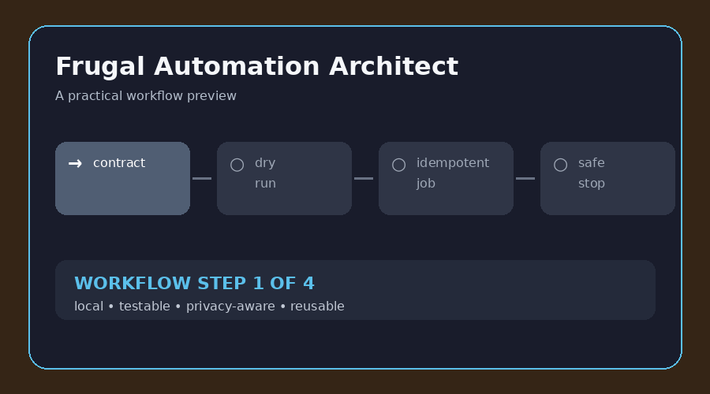

# Frugal Automation Architect

**Build small automations that are cheap to run, safe to retry, and easy to stop.** This skill covers Telegram bots, schedules, webhooks, local scripts, API adapters, idempotency, credential hygiene, observability, and rollback.

**বাংলা:** ফ্রি বা কম খরচে Telegram bot, scheduled job, webhook, file workflow বা personal automation বানাতে এই skill ব্যবহার করুন। প্রতিটি automation-এ dry-run, retry policy, stop control এবং secret protection রাখা হয়।

## What it helps with

| Need | Included approach |
| --- | --- |
| Low cost | Start with a local script before adding paid infrastructure |
| Safety | Preview side effects and require confirmation for irreversible actions |
| Reliability | Use stable event IDs, checkpoints, bounded retries, and review queues |
| Operations | Add status, logs, dry-run, stop, retry, and cleanup controls |

## Quick start

1. Read [`SKILL.md`](SKILL.md) and write the automation contract.
2. Follow [`examples/telegram-daily-digest.md`](examples/telegram-daily-digest.md).
3. Copy [`templates/automation-contract.yaml`](templates/automation-contract.yaml).
4. Test duplicate events, restarts, rate limits, invalid senders, and dry-run behavior.

## Practical example

The included **Telegram daily digest** example reads an approved local queue, builds a preview, sends at most one digest per stable job ID, and records failures without leaking tokens or repeating messages.

## Included files

| File | Purpose |
| --- | --- |
| [`SKILL.md`](SKILL.md) | Full workflow and quality gate |
| [`examples/telegram-daily-digest.md`](examples/telegram-daily-digest.md) | Concrete bot contract and failure tests |
| [`templates/automation-contract.yaml`](templates/automation-contract.yaml) | Reusable automation specification |
| [`assets/demo.gif`](assets/demo.gif) | Short visual workflow preview |

**Keywords:** free automation, Telegram bot, webhook, cron job, idempotent workflow, privacy automation, no-code alternative.
