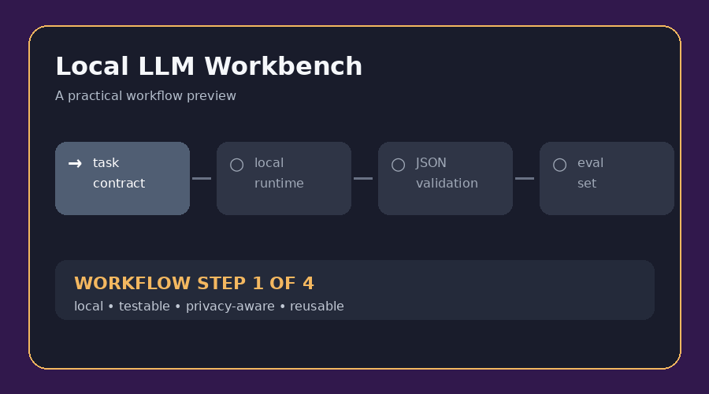

# Local LLM Workbench

**Evaluate private local-model workflows before reaching for a cloud API.** This skill covers runtime inspection, model selection, structured outputs, prompt testing, privacy boundaries, retries, caching, and honest evaluation.

**বাংলা:** নিজের কম্পিউটারে local LLM চালিয়ে summarization, extraction, classification বা chat workflow বানাতে এই skill ব্যবহার করুন। Cloud fallback থাকলে কোন data বাইরে যাবে সেটিও স্পষ্টভাবে নির্ধারণ করা হয়।

## What it helps with

| Need | Included approach |
| --- | --- |
| Model choice | Match the smallest model to a measurable task contract |
| Reliable output | Validate JSON/schema results and bounded retries |
| Privacy | Prefer loopback/local files and redact sensitive input |
| Quality | Use a small evaluation set instead of guessing from one demo |

## Quick start

1. Read [`SKILL.md`](SKILL.md) and define the model contract.
2. Follow [`examples/support-ticket-extractor.md`](examples/support-ticket-extractor.md).
3. Copy [`templates/llm-task-spec.yaml`](templates/llm-task-spec.yaml) for a new workflow.
4. Run offline, privacy, schema, and recovery checks before claiming success.

## Practical example

The included **support-ticket extractor** turns short messages into a validated JSON object, marks missing fields as unknown, and routes malformed or uncertain results for review instead of inventing an answer.

## Included files

| File | Purpose |
| --- | --- |
| [`SKILL.md`](SKILL.md) | Full workflow and quality gate |
| [`examples/support-ticket-extractor.md`](examples/support-ticket-extractor.md) | Concrete schema, prompt, and evaluation set |
| [`templates/llm-task-spec.yaml`](templates/llm-task-spec.yaml) | Reusable task contract |
| [`assets/demo.gif`](assets/demo.gif) | Short visual workflow preview |

**Keywords:** local LLM, offline AI, Ollama, structured extraction, JSON schema, prompt evaluation, privacy AI.
