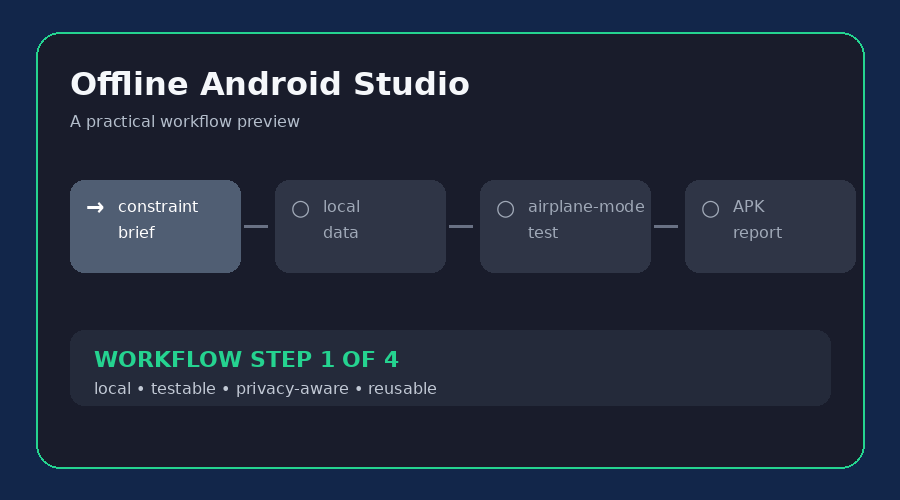

# Offline Android Studio

**Build Android apps that keep working when the network disappears.** This skill guides offline-first architecture, local data, dependency-minimal builds, privacy decisions, accessibility, testing, and APK packaging.

**বাংলা:** ইন্টারনেট না থাকলেও ব্যবহারযোগ্য privacy-first Android app বানানোর জন্য এই skill ব্যবহার করুন। এতে local storage, offline test, dependency control এবং APK delivery-এর ধাপ আছে।

## What it helps with

| Need | Included approach |
| --- | --- |
| Offline behavior | Define the critical path and test it with connectivity disabled |
| Privacy | Keep data local and avoid hidden analytics or remote assets |
| Low cost | Prefer platform features and already-available dependencies |
| Release quality | Record build variant, version, signing state, and limitations |

## Quick start

1. Open [`SKILL.md`](SKILL.md) and write the constraint brief.
2. Use [`examples/offline-notes-app.md`](examples/offline-notes-app.md) as a concrete blueprint.
3. Copy [`templates/offline-app-brief.md`](templates/offline-app-brief.md) for a new project.
4. Run the offline test matrix before describing the app as fully offline.

## Practical example

The included **Offline Notes app** example shows how to define local note data, draft recovery, export/import, airplane-mode testing, and a clear release report without depending on a paid backend.

## Included files

| File | Purpose |
| --- | --- |
| [`SKILL.md`](SKILL.md) | Full workflow and quality gate |
| [`examples/offline-notes-app.md`](examples/offline-notes-app.md) | Concrete app brief and acceptance tests |
| [`templates/offline-app-brief.md`](templates/offline-app-brief.md) | Reusable project-planning template |
| [`assets/demo.gif`](assets/demo.gif) | Short visual workflow preview |

**Keywords:** offline Android, offline-first app, Kotlin, Jetpack Compose, local storage, privacy-first APK.
