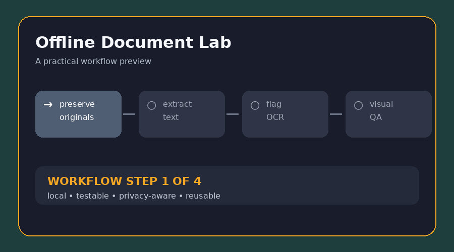

# Offline Document Lab

**Turn scans, PDFs, and tables into reviewable evidence without uploading them.** This skill provides a local workflow for intake, OCR, extraction, conversion, redaction preparation, batch processing, and quality control.

**বাংলা:** PDF, scan, image, office file বা spreadsheet local tool দিয়ে process করতে এই skill ব্যবহার করুন। Original file আলাদা রাখা, OCR ভুল চিহ্নিত করা এবং output যাচাই করা এখানে বাধ্যতামূলক।

## What it helps with

| Need | Included approach |
| --- | --- |
| OCR | Render only what is needed and flag uncertain pages |
| Evidence | Keep originals, manifests, coordinates, and transformations traceable |
| Tables | Preserve empty cells, identifiers, units, and review flags |
| Privacy | Avoid uploads and raw-content logs by default |

## Quick start

1. Read [`SKILL.md`](SKILL.md) and create `originals/`, `working/`, `outputs/`, and `logs/`.
2. Follow [`examples/invoice-batch-ocr.md`](examples/invoice-batch-ocr.md).
3. Copy [`templates/document-job-manifest.csv`](templates/document-job-manifest.csv) for a new batch.
4. Perform machine checks and visual spot checks before delivery.

## Practical example

The included **invoice batch OCR** example shows how to preserve source PDFs, extract native text first, OCR only scanned pages, retain page references, verify totals, and separate automatic results from manual review.

## Included files

| File | Purpose |
| --- | --- |
| [`SKILL.md`](SKILL.md) | Full workflow and quality gate |
| [`examples/invoice-batch-ocr.md`](examples/invoice-batch-ocr.md) | Concrete local OCR and QA example |
| [`templates/document-job-manifest.csv`](templates/document-job-manifest.csv) | Reusable traceability manifest |
| [`assets/demo.gif`](assets/demo.gif) | Short visual workflow preview |

**Keywords:** offline OCR, PDF processing, Tesseract, document extraction, table OCR, evidence preservation, local tools.
